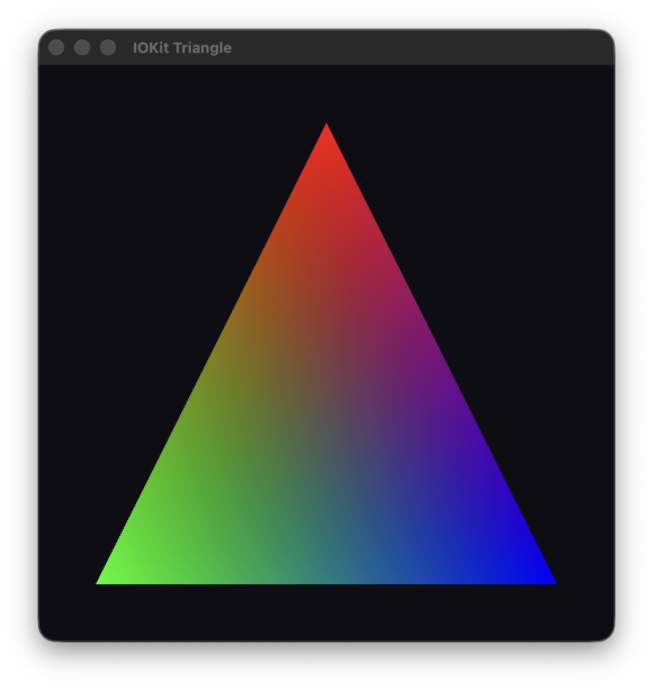

# AGX G16

A sandbox for exploring the M4 GPU

This repository contains the code that submits work to the GPU without Metal, passing data directly to IOKit

"Hello Triangle" sample can be found in the `triangle` folder

> **NOTE:** The kernel API is unstable and changed even over the lifetime of this project. The current code is tested and working on MacOS 26.6.2

## Credits

The reverse engineering method isn't my own. A detailed explanation of the approach can be found here:

- https://alyssarosenzweig.ca/blog/asahi-gpu-part-1.html

Another valuable source was the Mesa driver implementation for earlier GPUs:

- https://gitlab.freedesktop.org/mesa/mesa/-/tree/main/src/asahi

